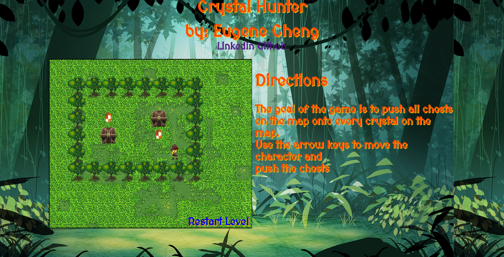

# Crystal Hunter


[Game Link][link]

[link]: http://www.eugenecheng.club/Crystal_Hunter/



## How It Works

This is a simple block game. The objective of the game is to push all the tiles onto the individual tiles using the arrow keys.


## Tools Used

Easel.js library was used in for all the sprites and images. I wanted to use Easel.js to see how the library was used. The game logic was implemented using vanilla JavaScript.

## Some Code

```javascript
class Tile extends createjs.Shape {

  constructor(x,y) {
    super();
    this.setPos(x,y);
  }

  setPos(x,y) {
    this.gameX = x;
    this.gameY = y;
    this.x = x * TILE_SIZE;
    this.y = y * TILE_SIZE;
  }

  getPos() {
    return {
      x: this.gameX,
      y: this.gameY
    }
  }

  move(dx, dy) {
    this.gameX += dx;
    this.gameY += dy;
    this.x += dx * TILE_SIZE;
    this.y += dy * TILE_SIZE;
  }
}
```
This is the tile superclass, where all the objects, such as the chest, diamonds, and hero, inherit from. This tile class inherits from the createJS Shape object, which allowed me use many of the Shape class' useful methods, such as bitMapFill, to make rendering images easier.
